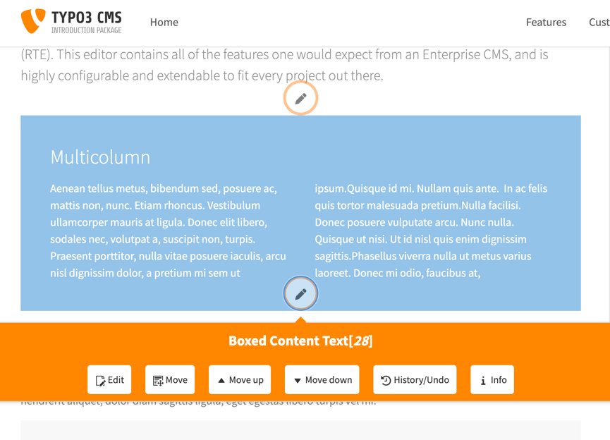
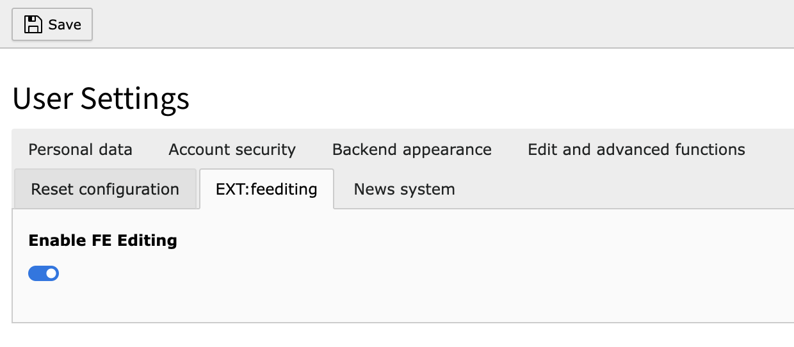

# TYPO3 Extension "feediting"

This extension provides the good old edit pencil icons in the frontend to have a fast experience to edit content.

- No in-place editing, no hassle with custom frontend implementations
- Link to the known and powerful backend editing
- Works with all content elements, pages and records

**Be aware:** This extension is heavly under development. Especially the UI is not final and will change. 
However, I am more than happy to get feedback and ideas. Please report at https://github.com/georgringer/feediting/issues.



## Requirements

- TYPO3 12 LTS

## Installation

Install this extension via composer `composer require georgringer/feediting`

## Usage

1. Log in as backend user
2. Enable/Disable the feature in the user settings



### Usage in Extensions

Use custom ViewHelper, see example below for `EXT:news`

```html
<html xmlns:f="http://typo3.org/ns/TYPO3/CMS/Fluid/ViewHelpers"
      xmlns:feedit="http://typo3.org/ns/GeorgRinger/Feediting/ViewHelpers"
      data-namespace-typo3-fluid="true">
<div class="article">
    <h3>
        <n:link newsItem="{newsItem}" settings="{settings}">{newsItem.title}</n:link>
        <feedit:panel uid="{newsItem.uid}" table="tx_news_domain_model_news"/>
    </h3>
</div>
</html>
```